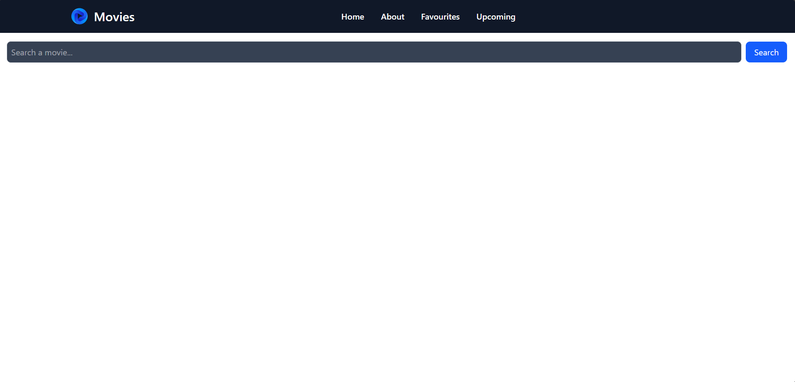
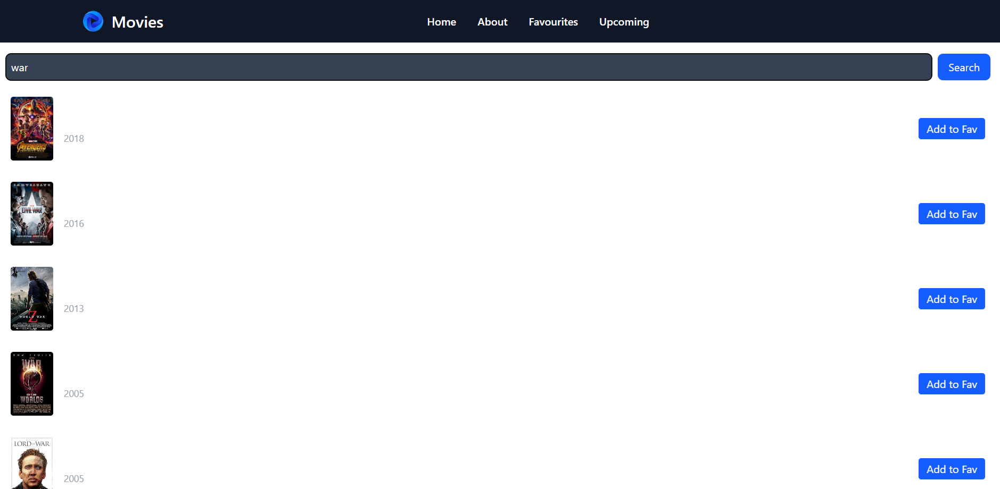
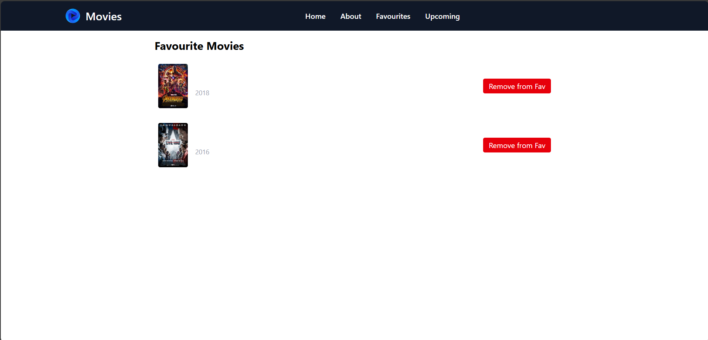
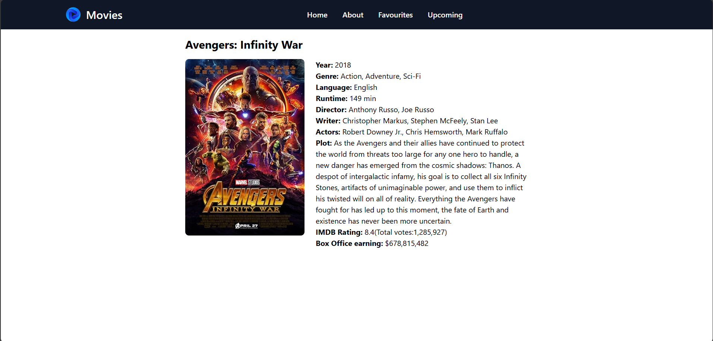

# 🎬 Movie Finder App

A simple React application that allows users to:

- 🔍 Search movies by name using the [OMDb API](https://www.omdbapi.com/)
- ⭐ Add movies to Favourites
- ❌ Remove movies from Favourites
- 📌 Persist favourite movies in `localStorage` so they remain after refresh
- 🎞️ View movie details on a dedicated page


---

## 🚀 Features

- Movie search powered by OMDb API  
- Responsive and modern UI  
- Add/remove favorites with one click  
- LocalStorage integration to persist user favorites  
- Navigation with React Router

---

## 📦 Technologies Used

- React 
- Vite 
- Tailwind CSS 
- React Router DOM 
- Axios 
- OMDb API 

---


## 🛠️ Getting Started

### 1. Clone the repository

```bash
git clone https://github.com/yogendrabaskota/searchMyMovie.git
cd searchMyMovie

```

### 2. Install dependencies
Make sure you have Node.js installed. Then run:
```bash
npm install
```

### 3. Get your OMDb API Key
- Go to [Omdb-Key](https://www.omdbapi.com/apikey.aspx)

- Sign up for a free API key


### 4. Set up environment variables
Create a .env file in the root of your project and add:
``` bash
VITE_OMDB_API_KEY = YOUR_API_KEY

```


### 5. Run the development server
```bash
npm run dev
```


## Project Structure
```bash
src/
│
├── components/
│   ├── Favouritelist.jsx       
│   ├── Moviecard.jsx
|   ├──Moviedetails.jsx
|   ├──Navbar.jsx
|   ├──Searchbar.jsx      
│
├── App.jsx                 
└── main.jsx                

```


## Project is live [Here](https://search-my-movie-phi.vercel.app)


## Output :
- Home Page:


- Search Movie Page:


- Favourite Movie Page:



- Movie Detail Page:



## Feedback
  If you have any feedback, please reach out to me at yogendrabaskota18@gmail.com  


